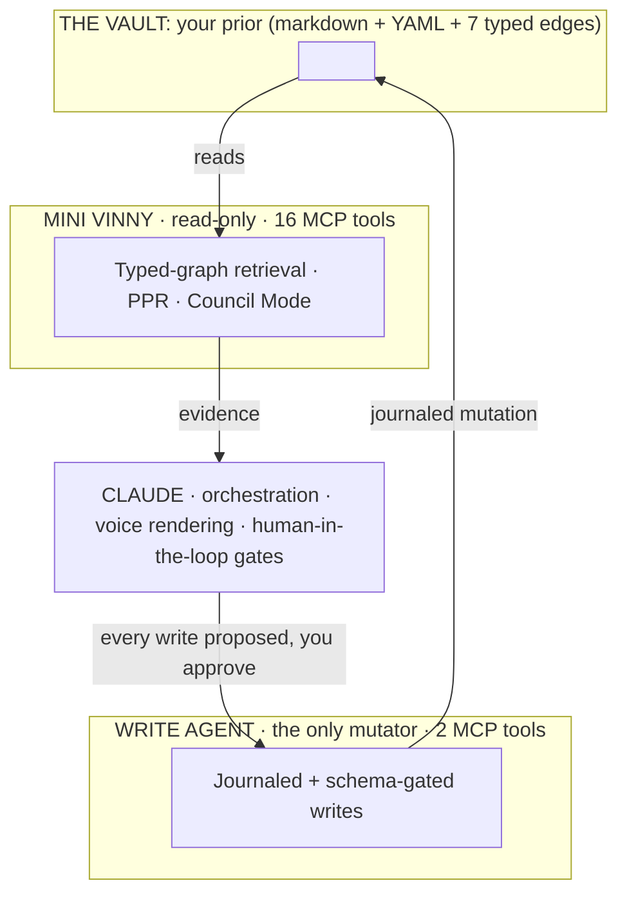
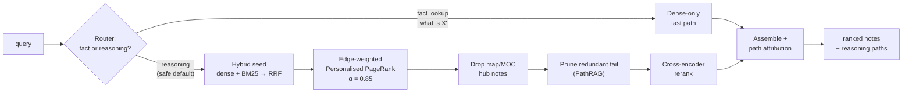

# Mini Vinny: a second brain that argues back

    

Most "second brains" make you a faster librarian. They fetch what you already
wrote and read it back to you in a calmer voice. This one is built to do the
opposite: to find the note that **contradicts** the one you're leaning on, and
put it on the table before you've finished being pleased with yourself.

It is a **knowledge-based AI** (KBAI) over an [Obsidian](https://obsidian.md)
vault: a *typed graph*, a real retrieval algorithm, and three cognitive "lenses"
that can disagree with each other in parallel. It is not a chatbot. It is not
built to reassure you; it is built to test you, to make you think with your own
writing as the prior.

Built by [@vinaynair](https://github.com/vinaynair). Local-first.
Privacy-preserving where it can be. Opinionated about boundaries.

> **The one-line version:** retrieval quality here is **measured, not asserted**:
> **MRR 0.69 → 0.88** on a held-out, content-grounded set, with the one regression
> I caught and fixed shown in full ([method](#show-me-the-numbers-the-eval-harness)).
> In a hurry, watch it think in [two annotated transcripts](#watch-it-think).

---

## Table of contents

1. [Why this exists](#why-this-exists)
2. [Yes, it's another second brain](#yes-its-another-second-brain)
3. [The idea in one minute](#the-idea-in-one-minute)
4. [Watch it think](#watch-it-think)
5. [How it works](#how-it-works)
6. [The typed graph](#the-typed-graph-meaning-that-travels)
7. [Cognitive profiles & Council Mode](#cognitive-profiles--council-mode)
8. [Show me the numbers](#show-me-the-numbers-the-eval-harness)
9. [Governance as architecture](#governance-as-architecture)
10. [Quick start](#quick-start)
11. [Reference](#reference)
12. [What this is not](#what-this-is-not)

---

## Why this exists

The tool you think *with* quietly decides what you can think. Every medium for
holding ideas imposes a shape, and most of the shapes on offer are not the shape
of a thought.

**A notebook is sequential.** Page 1 and page 40 sit thirty-nine pages apart, and
the idea you had on page 1 never meets the one on page 40 that completes it. A
linear medium can preserve a connection only if you happened to write the two
halves next to each other. Thought isn't linear; a notebook makes you pretend it
is.

**A spreadsheet is tabular.** Rows and columns are a gift to a machine and alien
to a mind. Nobody actually *thinks* in a grid. Forcing an idea into a table is a
translation into the machine's native tongue, and the translation loses precisely
the part that made the idea yours. (The vault has a note for this:
`cognitive-fit-theory`, on matching the representation to the structure of the
problem as epistemology, not decoration.)

**An ordinary knowledge graph is flat.** Link-based tools (vanilla Obsidian,
Roam) fix the sequence problem (page 1 *can* now touch page 40) but they trade it
for a subtler one: every link means the same thing. A line from a claim to its
rebuttal looks identical to a line from a claim to a passing mention. A graph
where all edges are equal isn't a structure; it's a hairball. It tells you *that*
things connect and hides *how*, which is the part that matters.

So: sequence loses the connection, tables lose the humanity, flat graphs lose the
meaning. What survives all three losses is the bet this system makes: a **typed
graph**, where the edge carries the relationship (*builds on, contradicts, is
analogous to*) the way a mind actually files an idea. Not by page number, not by
row, but by how it relates to what is already there.

### The fine line

There is a real cost, and it should be stated plainly. **Making a machine think in
human shapes costs money and time.** A flat pile of vectors is cheap, fast, and
inhumane. Every step back toward human cognition (typed edges, a graph walk that
follows them, three lenses arguing in parallel, a reasoning path that explains
itself) costs tokens and latency a simpler system never pays.

The whole project is an attempt to **introduce human cognition into a machine
system** without falling into either ditch: too machine and it is a plain search
box; too human and it is too slow and too expensive to actually use. That balance
is not an afterthought bolted on at the end; it *is* the engineering. It is why a
plain fact lookup skips the graph entirely (the [router](#how-it-works)), why
every note is compressed to a single machine-legible sentence, why the redundant
tail gets pruned and the [eval](#show-me-the-numbers-the-eval-harness) keeps score.
The discipline even has a name in the vault: `architectural-restraint`, the
*minimum capable system*. The line it walks is the line between a mind and a
machine.

---

## Yes, it's another second brain

In 2025 Andrej Karpathy published the **"LLM Wiki"** pattern, and a thousand
Obsidian tutorials bloomed. The pattern is genuinely good: dump raw material
into `/raw`, have an agent synthesise it into clean ~500-word wiki pages in
`/wiki`, and let an LLM reason over the tidy pages instead of the messy
transcripts. His own vault grew to ~100 articles and 400,000 words, *written
and maintained by the agent.* His core insight is correct and worth stating
plainly:

> **Synthesis beats raw chunks. An LLM reasons better over a dense, legible
> 500-word page than over an 8,000-word transcript.**

This system agrees with that completely. Every note here carries a hand-written
one-sentence `summary:`, authored *before the body*. That **is** the dense,
LLM-legible layer Karpathy is pointing at. We do not argue about synthesis.

We argue about **what happens after synthesis.** Karpathy built a well-organised
library and handed the LLM a library card. This system does something different
with the books.

| | Karpathy's **LLM Wiki** | **Mini Vinny / KBAI** |
|---|---|---|
| **Links** | plain wikilinks; the LLM follows them ad hoc | **7 *typed*, weighted semantic edges**: `builds-on`, `contradicts`, `analogous-to`, `operationalises`… The *meaning* lives in the edge, not in the prose |
| **Retrieval** | the LLM reads and navigates pages | a **deterministic graph algorithm**: edge-weighted Personalised PageRank, hybrid (dense + BM25) seeding, cross-encoder reranking, path attribution |
| **Stance** | dissent is *ad hoc*: you must prompt for it | dissent is *structural*: a skeptic lens with a `seek` policy plus typed `contradicts` edges surface it unbidden (see [Demo 2](#watch-it-think)) |
| **Who writes** | the agent (≈400k words, agent-generated) | **the human.** The retrieval agent cannot write a single byte; writes go through one journaled, schema-gated Write Agent that you approve |
| **Quality** | asserted: it's a pattern, not a measurement | **measured**: a content-grounded eval set and a recorded **MRR of 0.883** |

**The library, versus the argument.** Karpathy's agent builds the library and
keeps it tidy. This one refuses to write the books at all (the thoughts have to
be yours) and instead spends its effort making you *disagree with them*. A second
brain that only ever agrees with you is just a faster echo. This one has a skeptic
with a seat at the table.

The vault even contains a note called `knowledge-compression-translation-problem`:

> *"Every second brain sits at the boundary between continuous human thought and
> discrete machine representation; the design question is what compression bridge
> preserves both registers faithfully."*

In other words, Vinay wrote the theory of Karpathy's synthesis layer into the
vault, then built a graph that retrieves it. And `KBAI` literally stands for
*Knowledge-Based AI*, so "explain AI using a KBAI system" is not a slogan; it's a
description of the next section.

---

## The idea in one minute

A second brain is only as good as its **retrieval**. You can hoard ten thousand
notes and still get worse answers than someone with fifty well-connected ones.
The bottleneck was never storage. It is *finding the right three notes, including
the one you'd rather forget, at the moment you need them.*

This system makes three bets:

1. **Meaning travels through structure, not similarity.** Notes connect via a
   closed vocabulary of **typed edges**. `builds-on` is not `contradicts` is not
   `analogous-to`. Retrieval walks those typed edges, so it can cross a domain
   boundary that pure vector similarity would never cross (you'll see exactly this
   in the transcript below).

2. **Thinking has more than one mode.** The same question deserves a different
   walk of the graph depending on whether you're exploring, operationalising, or
   trying to break an idea. Six **cognitive profiles** re-weight the graph for
   each mode; the flagship, **Council Mode**, runs three of them (explorer,
   operator, skeptic) at once and reports the consensus *and the dissent*.

3. **The machine retrieves; the human writes.** Reading and writing are
   different privileges held by different agents. The reader is read-only by
   construction. The writer journals every mutation and validates it against a
   schema before it touches disk. This is AI governance expressed as
   architecture, not as a policy PDF.

Everything below is those three bets, built and measured.

---

## Watch it think

Two real queries, two real outputs: **verbatim transcripts** from the running
system, not mocked. This is the system explaining AI concepts using its own
graph: a *knowledge-based AI* doing knowledge-based reasoning over your own notes.

### Demo 1: the graph crosses a domain boundary

**You ask:** *"interpretability vs explainability in machine learning"*

The hybrid seed lands first on your own note,
`interpretability-vs-explainability` (Rudin's inherent legibility vs Lipton's
post-hoc introspection). Nothing clever yet; a vector search would find that too.
Then the **graph walk does what similarity can't**: it follows your typed edges
across a domain boundary.

```
seed:  interpretability-vs-explainability        (your XAI note)
 ↓ Personalised PageRank over typed edges
hop:   causal-ML-landscape  ──builds-on──▶  pearls-ladder
       pearls-ladder        ──analogous-to──▶  imposed-vs-discovered-structure
```

It surfaces `imposed-vs-discovered-structure` (your argument that *parametric
interpretability is structure imposed before seeing the data*) and reaches it
**through Pearl's ladder of causation**, because you once drew an `analogous-to`
edge between "asserting a functional form" and "asserting a causal DAG." Pure
embedding search has no idea those two ideas are related; they share almost no
surface vocabulary. The **edge you drew** is what carried the meaning. That hop,
XAI to causal inference via an analogy you noticed months ago, is the entire
thesis of the system in one retrieval.

### Demo 2: the skeptic seat

**You convene the council:** *"is explainability enough for trustworthy and
accountable AI?"*

The same query runs through three lenses in parallel (**explorer**, **operator**,
**skeptic**), and the system reports the overlap structure:

```
UNANIMOUS (all three lenses agree):
  governance-capital · interpretability-vs-explainability · pearls-ladder
  ml-model-fundamentals · ai-business-concepts · imposed-vs-discovered-structure
  acemoglu-task-exposure · schumacher-principle            (8 notes)

UNIQUE TO SKEPTIC:
  separate-executor-from-adversary  ← nobody else found this
```

Eight notes reach unanimous consensus: the shared spine of the answer. But the
**skeptic alone** drags in `separate-executor-from-adversary`:

> *"In an automated reasoning loop the agent that does the work cannot be trusted
> to judge it."*

Nobody asked about adversarial review. The question was about explainability.
The skeptic lens went and found the *governance objection* anyway: the argument
that explanation is not accountability, because the thing explaining itself has a
stake in the verdict. That is the seat at the table that agreement-shaped systems
do not have.

---

## How it works

### Architecture: three agents, two fidelity axes



Two **independent fidelity axes** sit on top, and they never overlap:

- **Voice fidelity** (how an answer *reads*): `naval`, `tharoor`, `bourdain`,
  `clarkson`, combinable with `+`. Pure rendering.
- **Thinking fidelity** (what gets *retrieved*): six cognitive profiles that
  re-weight the graph walk. Pure retrieval.

Voice changes the prose. Profiles change the evidence. You can swap either
without touching the other, which is the whole point of keeping them apart.

### The retrieval pipeline

This is the engine. A query enters; a ranked, *attributed* set of notes leaves.
Each stage exists because a measurement said it should (see
[the eval harness](#show-me-the-numbers-the-eval-harness)).



Stage by stage, in plain English:

1. **Hybrid seed: find the starting notes two ways at once.** A *dense* vector
   search (the `BAAI/bge-small-en-v1.5` embedding model, ~33M parameters and
   ~130 MB on disk, running on your CPU; cosine similarity over note summaries)
   catches *meaning*; a *sparse* BM25 keyword search (SQLite FTS5) catches *exact
   terms* the embedding might blur. The two ranked lists are merged with
   **Reciprocal Rank Fusion** (RRF, k=60), a parameter-free way to combine
   rankings that rewards notes both methods like. If there's no keyword index, it
   degrades gracefully to dense-only.

2. **Route: don't use a sledgehammer on a thumbtack.** A small regex classifier
   reads the query. If it's a flat fact lookup ("*what is a DAG*", "*define
   SHAP*") it takes a **dense-only fast path** and skips the graph entirely.
   RAG-vs-GraphRAG evaluations ([arXiv:2502.11371](https://arxiv.org/abs/2502.11371))
   find the graph walk earns its keep on multi-hop reasoning but adds little beyond
   redundant context on single-hop fact lookups. Anything relational ("*vs*",
   "*how*", "*why*", "*compare*", "*and*") gets the full walk. Reasoning is the
   safe default; the fast path is the exception it has to *earn*.

3. **Edge-weighted Personalised PageRank: walk the graph from the seeds.**
   PageRank is the algorithm that ranked the early web: importance flows along
   links. *Personalised* PageRank biases that flow to start from *your* seed
   notes (damping α = 0.85). The twist here: **every edge type has a different
   weight** (`builds-on` 1.5, `analogous-to` 1.3, `contradicts` 1.2, down to
   `mentioned` 0.3), so the walk prefers strong semantic relationships over
   incidental name-drops. A cognitive profile changes those weights: *same
   algorithm, different topology of attention.*

4. **Drop the map notes.** Index and "Map of Content" hub notes are highly
   central, so PageRank loves them, but a map is *navigation*, not an *answer*.
   They're kept in the walk (they help route attention) and dropped from the
   results. This single change recovered a measured regression; see below.

5. **Prune the redundant tail (PathRAG-style).** The insight from
   [PathRAG](https://arxiv.org/abs/2502.14902): the failure mode of graph
   retrieval is *redundancy*, not insufficiency. So the long tail of
   weakly-connected notes (below 5% of the top score) is trimmed conservatively:
   always keeping the original seeds, never going below a floor.

6. **Cross-encoder rerank.** The first stages optimise for *recall* (find the
   right cluster). A cross-encoder (`cross-encoder/ms-marco-MiniLM-L-6-v2`) then
   optimises for *precision of order*: it reads each (query, note-summary) pair
   jointly and re-sorts. This was the single biggest quality win in the eval
   (+23% MRR). It loads lazily and fails soft: no network, no problem, the
   pipeline just skips it.

7. **Assemble and attribute.** Finally, the system loads note content under a
   character budget and computes a **reasoning path** for each retrieved note:
   the actual chain of typed edges connecting it back to a seed (the
   `causal-ML-landscape ──builds-on──▶ pearls-ladder ──analogous-to──▶ …` you saw
   in Demo 1). Path-finding runs over *inverted* taxonomy weights, so it prefers
   to explain a result through strong edges rather than structural ones. **The
   answer shows its work.**

That reasoning path is the difference between a system that says *"here are some
related notes"* and one that says *"here is this note, and here is the specific
intellectual route by which it is relevant."* A plain wiki hands the LLM pages and
trusts it to navigate; this one hands you the derivation explicitly (the
typed-edge chain by which a note became relevant), so the route is auditable, not
inferred.

---

## The typed graph: meaning that travels

A plain Obsidian `[[wikilink]]` says *"these two notes are related."* It does not
say *how.* That missing "how" is where most knowledge graphs quietly fail: a link
from a claim to its counter-argument and a link from a claim to a passing mention
look identical to the machine.

Mini Vinny closes a **fixed taxonomy of edge types**, each with a default weight
used by the PageRank walk. Authoring a link means *committing to a relationship*:

| Edge | Weight | Means |
|---|---|---|
| `builds-on` | 1.5 | A depends on / extends / derives from B |
| `builds-toward` | 1.5 | A is a step toward B (reversed to `builds-on` at load) |
| `analogous-to` | 1.3 | A and B share a structural pattern across **different domains** |
| `contradicts` | 1.2 | A and B make incompatible claims |
| `exemplifies` | 0.85 | A is a concrete instance of abstract principle B |
| `operationalises` | 0.85 | A is how B becomes practice |
| `challenges` | 0.80 | A complicates or qualifies B without fully contradicting |
| `referenced-in` | 0.8 | structural; A appears in map B |
| `untyped` | 0.6 | a link not yet classified |
| `mentioned` | 0.3 | A is named in B with no labelled relationship |

The first seven are *semantic claims*; the last three are *structural plumbing*.
Because the vocabulary is closed and weighted, the graph is a queryable object,
not a hairball, and the same closed set is the knob the cognitive profiles turn.

The graph is honest about its own shape, too: it is **not a DAG**. It contains
`contradicts` cycles, irreducible epistemic tension that *cannot* be topologically
sorted, and shouldn't be. (There's a note about that, naturally:
`vault-as-cyclic-directed-graph`.)

---

## Cognitive profiles & Council Mode

A profile is a set of edge-weight overrides and traversal policies: *same graph,
different walk.* Defined declaratively in `kbai/cognitive_routing/profiles/*.yaml`.

| Profile | Boosts | Use for |
|---|---|---|
| `default` | (none) | balanced retrieval |
| `explorer` | `analogous-to`, `exemplifies` | cross-domain parallels |
| `operator` | `operationalises`, `exemplifies` | concrete how-to |
| `builder` | `builds-on`, `builds-toward` | genealogy, lineage of an idea |
| `skeptic` | `contradicts`, `challenges` | counter-arguments |
| `exhaustive` | admits `mentioned` | deep audits |

### Why these edges? The design reasoning

A profile is not an arbitrary bag of knobs. Each lens is a *mode of thinking*, and
the edges it boosts are the edges that mode actually travels. The overrides are
**multipliers on the base taxonomy weights** (the applier multiplies, it never
replaces), so a profile *tilts* the shared graph rather than rebuilding it. Two
policies ride alongside the weights: `contradiction_policy` (`suppress` / `allow`
/ `seek`) decides whether dissent is hidden, tolerated, or actively hunted;
`mention_policy` (`ignore` / `exhaustive`) decides whether weak name-drops are
walked at all.

| Lens | Tilts toward (×) | Damps (×) | Contradiction · Mention | The reasoning move it encodes |
|---|---|---|---|---|
| `explorer` | `analogous-to` ×1.6, `exemplifies` ×1.4 | (none) | allow · ignore | *"What else is shaped like this?"* Boosts the only two edges that cross domain boundaries (analogy and instantiation), so the walk leaves its home topic. Allows `contradicts` (it *notices* tensions) without hunting them. |
| `operator` | `operationalises` ×1.6, `exemplifies` ×1.3 | `builds-on` ×0.85, `analogous-to` ×0.85 | suppress · ignore | *"How do I actually do this?"* Boosts the two edges that run principle → practice; damps the abstract and lineage edges that lead away from action. Short paths keep it near the seeds. |
| `builder` | `builds-on` ×1.7, `builds-toward` ×1.5 | `analogous-to` ×0.9, `exemplifies` ×0.85 | suppress · ignore | *"Where does this come from?"* Boosts the dependency edges so the walk follows derivation back toward first principles; deep paths surface the whole lineage, not just the parent. |
| `skeptic` | `contradicts` ×1.6, `challenges` ×1.3 | `builds-on` ×0.9 | **seek** · ignore | *"Why might this be wrong?"* Boosts the two adversarial edges **and** flips contradiction from suppressed to sought. Deliberately damps `builds-on`, which in a mature cluster would otherwise drown dissent in agreement. |
| `default` | (none) | (none) | suppress · ignore | Balanced fallback. Hides `contradicts` and weak `mentioned` ties; the neutral baseline. |
| `exhaustive` | (none) | (none) | allow · **exhaustive** | *"Show me everything, including the weak ties."* Admits `mentioned` and `contradicts` so the walk reaches notes every other lens gates out. Built for audits, not answers. |

The point is that **every lens reuses the same closed edge vocabulary.** There is
no separate "explorer graph." The taxonomy was designed so that each edge type *is*
a distinct epistemic move: derivation (`builds-on`), analogy (`analogous-to`),
instantiation (`exemplifies`), operationalisation (`operationalises`),
contradiction (`contradicts`), qualification (`challenges`). A cognitive profile
is simply a *weighting over those moves*. That is why adding a lens needs **no new
edge types**, and why an eventual person-named profile will be *learned as a
weighting from usage*, never hand-coded.

> **Honest footnote:** the edge-weight multipliers and the contradiction/mention
> policies are live in the PPR walk today. Two further fields,
> `path_length_preference` and `abstraction_preference`, are declared design
> intent: passed through but *not yet consumed* by the walk
> (`kbai/cognitive_routing/applier.py` says exactly that). They are wired in a
> later stage. Shipping the honest version beats shipping the impressive one.

**No profile is named after a person.** Naming a profile "Karpathy" or "Pearl"
would be a claim to model that mind, and there's no data backing that claim yet.
Until calibration *earns* a named lens from real usage, only functional lenses
ship. (The system logs every Council invocation to a `council_events` table
precisely so that one day it can.)

**Council Mode** is the flagship. It runs explorer + operator + skeptic in
parallel on one query and returns a `CouncilEvidence` object: each lens's top
notes, plus the **consensus / unanimous / unique-to** overlap analysis you saw in
Demo 2. Claude then synthesises under fixed rules:

- Consensus first.
- Each lens's *unique* contribution named.
- **The skeptic must speak.**
- Disagreement called out explicitly, never smoothed over.
- A recommendation that names *how the debate sharpened it.*

It is, deliberately, the opposite of a chatbot that reflects your framing back at
you. Three lenses, one of them adversarial by design, forced to show their
disagreement.

---

## Show me the numbers: the eval harness

Anyone can claim their retrieval is good. This one is **measured**, on a held-out
set, with the regressions left visible.

### The metrics

- **MRR** (Mean Reciprocal Rank): *how high does the first right answer land?*
  If the first relevant note is at rank 1 you score 1.0; rank 2 scores 0.5; rank 4
  scores 0.25. Rewards getting the best note to the *top*.
- **recall@10**: *of all the notes that should appear, what fraction made the top
  10?* Measures coverage.
- **primary-hit@3**: *did the single most canonical note land in the top 3?* The
  strictest, most user-facing test.

### The golden set (and why it's honest)

The eval runs against `eval/golden_set.yaml`: **10 queries**, each with a
hand-chosen `primary` note and a set of `expected` notes. The crucial design
choice is that it is **content-grounded, not retriever-grounded.** The expected
notes were chosen by *reading note summaries that genuinely answer the query*,
**never by running the retriever.** Building a golden set from your own retriever's
output is circular: you'd be grading the system against its own opinion and
congratulating yourself. By grounding labels in content the retriever never sees,
the benchmark can actually catch the retriever being *wrong*. It's labelled
"silver," not "gold" (the 10 labels are Claude-generated, not yet expert-curated)
and built to be upgraded note by note.

### The result: MRR 0.69 → 0.88

| Stage | What changed | MRR | recall@10 | primary-hit@3 |
|---|---|:---:|:---:|:---:|
| **Baseline** | hybrid seed → PPR → prune | 0.689 | 0.717 | 0.60 |
| + cross-encoder rerank | reorder by query/summary relevance | **0.850** | 0.758 | 0.50 ⚠️ |
| + drop map/MOC from results | hubs guide the walk, not the answer | **0.883** | 0.758 | **0.70** |
| + query router | dense fast-path for fact lookups | 0.883 | 0.758 | 0.70 |
| **Recorded endpoint** (`eval/baseline.json`) | | **0.883** | **0.792** | **0.70** |

*Recall@10 reads 0.758 at each slice and 0.792 at the recorded endpoint: the
endpoint is a later re-run after the silver golden set was corrected, so the two
figures are measured against slightly different label sets.*

Read the middle of that table, because it's the part that matters. Reranking
bought a **+23% MRR jump**, and *broke* primary-hit@3, dropping it from 0.60 to
0.50. The cross-encoder, asked to rank by topical relevance, kept promoting the
broad "map" hub notes above the one sharp answer. It would have been easy to ship
the headline +23% and never mention the regression. Instead the eval *caught* it,
the diagnosis was maps over-ranking, and the next slice (dropping map notes from
the result set) **recovered primary-hit to 0.70 and pushed MRR to its best
value.** The query router that followed was, by measurement, quality-neutral: a
pure efficiency play on a concept-heavy vault, shipped *because* the eval proved it
cost nothing.

That loop (change, measure, catch the regression, fix it, measure again) is the
whole discipline. The number is 0.883. The *method* is the point.

### Tests

```bash
VAULT_ROOT=/path/to/vault pytest minivinnymcp/tests/ writeagentmcp/tests/ -q
# 342 passing
```

A four-level taxonomy: **L1** unit (single module, no I/O), **L2** integration
(module to storage), **L3** contract (every MCP tool result validated against a
`kbai/contracts.py` Pydantic model), **L4** retrieval eval (the harness above).

---

## Governance as architecture

This is the part that matters if you care about AI *governance* rather than raw
*capability*, and it is the sharpest break from the "let the agent maintain
400,000 words" school.

**The single-writer invariant.** Mini Vinny, the agent you talk to all day,
contains *no file-writing code at all.* It is read-only by construction, not by
politeness. Every mutation in the entire system flows through one place: the
**Write Agent**, exposing exactly two tools (`write_create_note`,
`write_apply_link_suggestions`).

**Every write is journaled.** The Write Agent records each mutation before it
lands. There is an audit trail by default, not as an afterthought.

**Every write is schema-gated.** `kbai/schema.py` is the single source of truth
for what a valid note looks like: required fields, allowed enum values, the keys
permitted per note type. A write with a missing `summary`, an out-of-enum
`status`, or an unknown key is **hard-rejected** rather than landing malformed in
the vault. (This isn't theoretical: a hand-assembled write path once produced
schema drift, and the gate is the fix that made it impossible to repeat.)

**Embed-on-write freshness.** A newly created note is embedded into the vector
index at write time, so it is searchable immediately: no nightly reindex, no
window where a note exists but can't be found.

**A healthcheck against silent failure.** The nastiest failure mode in a
retrieval system is the *quiet* one: the file-listing tool still works (it walks
the disk), so nothing looks broken, while search silently returns zero. `python
healthcheck.py` asserts that **both** search layers (semantic and text) return
hits for a term drawn from the index itself, and exits non-zero with a *specific
cause* otherwise. It refuses to let the system fail politely.

Read-only by default. Mutations centralised, journaled, and validated. A human in
the approval loop for every write. That's not a compliance checkbox bolted on
afterward; it's the load-bearing structure of the codebase.

---

## Quick start

Requires Python 3.10+ and an Obsidian vault.

```bash
git clone https://github.com/vinaldo7-design/KBAI-second-brain.git
cd KBAI-second-brain

python -m venv .venv && source .venv/bin/activate
pip install -r minivinnymcp/requirements.txt
pip install -r writeagentmcp/requirements.txt
pip install pydantic pytest

# 1. Build the typed graph from your vault
python vault_graph.py /path/to/vault

# 2. Build the embedding index (first run downloads the BGE model, ~130 MB)
python vault_embed.py

# 3. Verify both search layers are alive (guards against silent failure)
python healthcheck.py

# 4. Run the test suite
VAULT_ROOT=/path/to/vault pytest minivinnymcp/tests/ writeagentmcp/tests/ -q
```

### Wiring into Claude Desktop

Two MCP servers, configured in
`~/Library/Application Support/Claude/claude_desktop_config.json`:

```jsonc
{
  "mcpServers": {
    "mini-vinny": {
      "command": "/path/to/python",
      "args": ["-m", "minivinnymcp.server"],
      "env": { "VAULT_ROOT": "/path/to/vault" }
    },
    "write-agent": {
      "command": "/path/to/python",
      "args": ["-m", "writeagentmcp.server"],
      "env": { "VAULT_ROOT": "/path/to/vault" }
    }
  }
}
```

Restart Claude Desktop after edits; the MCP tool list is cached at process start.
Slash commands and voices live canonically in `~/.claude/commands/` and
`~/.claude/voices/`; the copies under `claude/` here are a versioned snapshot for
review. Copy them across to use them:

```bash
cp claude/commands/*.md ~/.claude/commands/
cp claude/voices/*.md   ~/.claude/voices/
```

---

## Reference

### Slash commands (21)

Each command encodes the right tool sequence for one intent; prefer them over
ad-hoc tool calls.

**Discovery:** `/find` (semantic search, top-5 + summaries), `/recent [N]`,
`/today`, `/touched <topic>`, `/morning` (daily orientation, *experimental*).

**Read & explain:** `/about <note>` (note + its graph neighbourhood),
`/analogies <note>` (cross-domain parallels), `/ops <note>` (operational how-to),
`/paths <a> <b>` (how two notes connect).

**Pressure-test:** `/challenge <note>` (skeptic-lens counter-arguments),
**`/council <query>`** (the flagship), `/compare-thinkers <p1>+<p2> <query>`,
`/pressure-test <note>` (auto-escalates challenge to council).

**Generative:** `/imagine <note>` (propose new research domains from cluster
shape: extend / fracture / bridge / deepen / historicise).

**Maintenance:** `/audit` (read-only vault health), `/audit-edges <t1> <t2>`
(triage mis-typed edges), `/connect <note>` (suggest new typed links, preview
only), `/capture <text>` (idea capture; preview, then write on confirmation).

**Voice & routing:** `/voice <name> <query>`, `/voices`, `/ask <query>`
(deterministic intent router).

A fuller user guide lives in [`docs/operating-manual.md`](docs/operating-manual.md).

### Voice library

Modular, combinable with `+`: `naval` (aphoristic compression), `tharoor` (long
erudite argument), `bourdain` (vernacular observation), `clarkson` (hyperbolic
provocation). `/voice naval+bourdain explain X` picks dimensions from each rather
than mechanically averaging. Voice affects *how* an answer reads, never *what* is
retrieved.

### Repository layout

```
.
├── kbai/                      # Core library (importable, framework-free)
│   ├── retrieve/              # THE ENGINE: dense, sparse, ppr, prune,
│   │                          #   rerank, router, path, assembler
│   ├── cognitive_routing/     # Profiles, registry, applier
│   │   └── profiles/          # YAML profile definitions (the 6 lenses)
│   ├── council/               # Council Mode retrieval + overlap analysis
│   ├── eval/                  # Metrics + golden-set runner (MRR/recall/hit)
│   ├── embed/                 # Embed-on-write freshness indexer
│   ├── storage/               # note_io, resolver, writers, journal
│   ├── instrumentation/       # note_hits + council_events logs
│   ├── schema.py              # Canonical frontmatter schema, single source of truth
│   └── contracts.py           # Pydantic models for every boundary
│
├── minivinnymcp/              # Mini Vinny MCP server (read-only, 16 tools)
├── writeagentmcp/             # Write Agent MCP server (live, 2 journaled mutators)
│
├── claude/{commands,voices}/  # Slash-command + voice snapshot (canonical: ~/.claude/)
├── docs/                      # operating-manual, refactor-plan, refactor-state
├── eval/                      # golden_set.yaml + baseline.json
│
├── healthcheck.py             # Guard both search layers against silent failure
├── vault_graph.py             # Vault to typed JSON graph builder
├── vault_graph_loader.py      # NetworkX wrapper: PPR, paths, centrality
├── vault_embed.py             # BGE to sqlite-vec indexer
├── vault_taxonomy.yaml        # The closed edge-type set (weights live here)
└── CLAUDE.md                  # Governance doc: session protocol + doctrine
```

---

## What this is not

- **Not a chatbot.** It's built to make you disagree with yourself, not to keep
  you company.
- **Not a RAG demo.** Retrieval is graph-shaped, typed, lensed by cognitive
  profile, and *measured*. The vector search is one of seven stages.
- **Not a productivity tool.** No tasks, no kanban, no calendar. Thinking with
  your own notes as the prior is the entire product surface.
- **Not finished, on purpose.** The architecture is done; the *calibration*
  isn't. Person-named profiles, expert-graded gold eval, and bi-temporal graph
  memory are all gated on accumulated usage data, not on more code. The system is
  designed to earn its next features rather than assume them.

---

## Companion writing

A Substack series on architectural restraint, AI governance, and building
*minimum capable systems*: the principle that the smallest system that does the
job is a governance position, not a cost saving. The vault is the staging ground;
the essays are the published artefacts.

## License

MIT.
